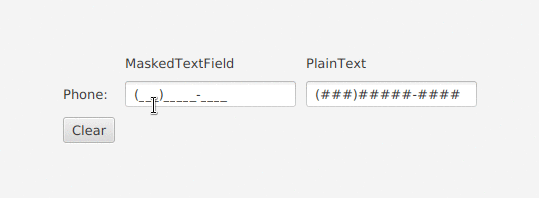

# MaskedTextField

This component is very similar to JFormmatedText field and can be used in same way. Including the functionalites of copy|paste content, dinamically change placeholder and mask.

The following table shows the characters that you can use in the formatting mask:

|Character | Description |
| ------------- | ------------- |
| \# | Any valid number (Character.isDigit) |
| ' | Escape character, used to escape any of the special formatting characters. |
| U | Any character (Character.isLetter). All lowercase letters are mapped to uppercase |
| L | Any character (Character.isLetter). All uppercase letters are mapped to lowercase |
| A | Any character or number (Character.isLetter or Character.isDigit) |
| ? | Any character (Character.isLetter) |
| * | Anything |
| H | Any hex character (0-9, a-f or A-F) |

# Demonstration



# Using in JavaFX code (without FXML)

``` java
// Created mask for phone with default placeholder "_"
MaskedTextField text = new MaskedTextField("(###)#####-####"); // Only Number

// Change placeholder to empty space
text.setPlaceHolder(" ");

// Change mask (Preserve the text respecting the new mask)
text.setMask("((####))");
```

# Using in FXML
```
<?import packagepath.MaskedTextField?>

<MaskedTextField mask="(###)#####-####" placeholder=" " plainText="5555"/>
```
The available tags to use in FXML are: mask, placeholder and plainText;

# Known issues
When user paste large text with multiple wrong characters the mask will broke.
